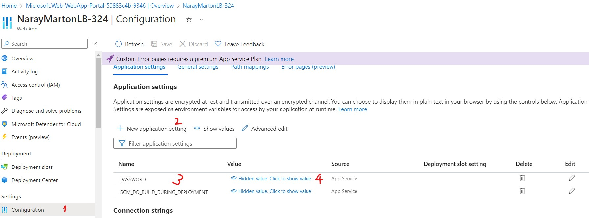

# LB 324

## Aufgabe 2

Erklären Sie hier, wie man `pre-commit` installiert.

1. Im ersten Schritt muss man pre-commit mit `pip` installieren:
   ```
   pip install pre-commit
   ```
2. Im nächsten Schritt geht es darum, ein Script in .git/hooks/ zu erstellen:
   ```
   pre-commit install --hook-type pre-commit --hook-type pre-push
   ```
3. Zuletzt kann getestet werden, ob alles lauft:
   ```
   pre-commit run -a --hook-stage commit # formatieren
   pre-commit run -a --hook-stage push # testen
   ```

## Aufgabe 4

Erklären Sie hier, wie Sie das Passwort aus Ihrer lokalen `.env` auf Azure übertragen.

1. Ich habe eine Webanwendung auf Azure erstellt.
2. Als nächstes habe ich eine Umgebungsvariable für die Anwendung gesetzt:
   1. Zuerst bin ich unter `Settings` auf `Configuration`.
   2. Als zweites habe ich auf `New application setting` geklickt.
   3. Im dritten Schritt habe ich die Variable `PASSWORD` genannt.
   4. Und im vierten Schritt habe ich den tatsächlichen Wert des Passworts gesetzt.
3. Danach konnte ich das gesetzte Passwort verwenden, um mich einzuloggen.


